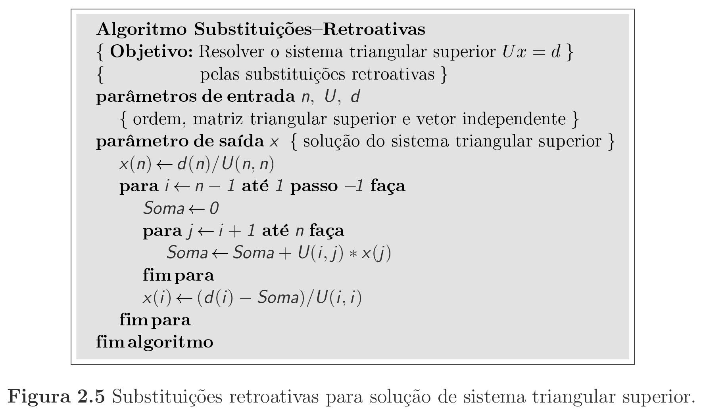
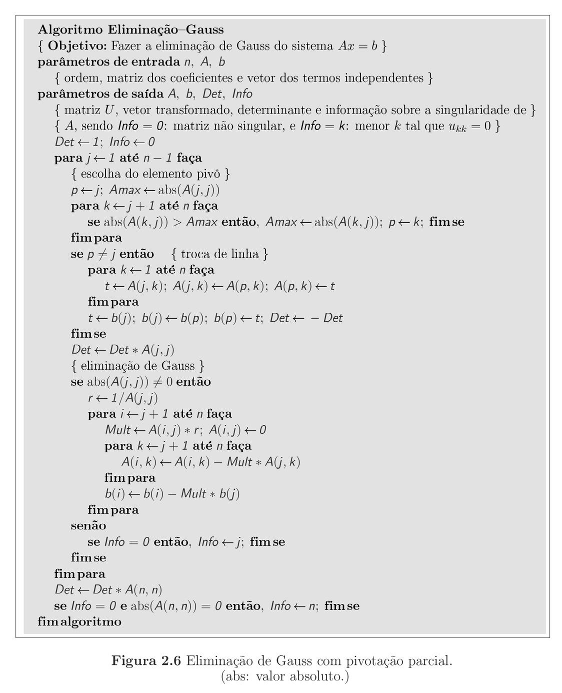

# Eliminação de Gauss 
Este método transforma uma matriz A em uma matriz trinagular superior 

## Sem pivotação parcial
Essa versão não troca as linhas

## Com pivotação parcial
Essa versão não troca as linhas

## Substituições retroativas

# Resposta
https://docs.google.com/document/d/1M9WoT2PYhlmuVJpOvQ5GWaF9CUhA9K1I/edit?usp=sharing&ouid=111761202241241285498&rtpof=true&sd=true
